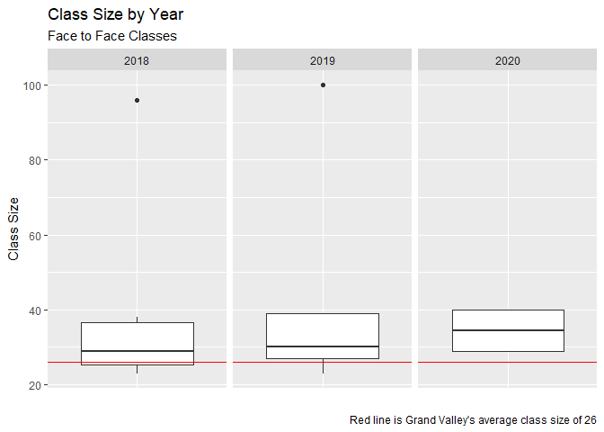
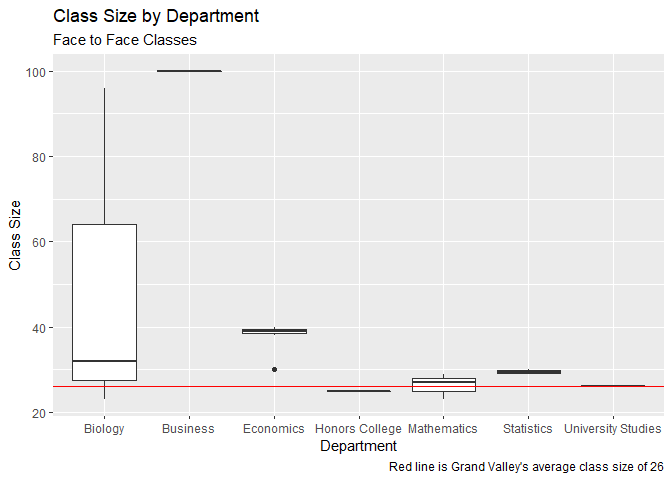

Class Size
================
Jason Smith
5/13/2020

# Introduction

This summer, schools across the country are having to make the difficult
decision of whether to reopen for in the fall or to remain in an online
format. Grand Valley has noted over the past few weeks that the
university is in a [“unique
position”](https://www.gvsu.edu/gvnext/2020/gvsu-plans-for-face-to-face-learning-this-11525.htm)
due to newer facilities and an average class size of 26.

I am curious how my classes have held up to that magic number.
Fortunately, you can access the number of students in past courses
(among other things) in Banner. This is the story of that afternoon
project.

# The Data

``` r
library(readxl)
library(tidyverse)
library(kableExtra)
library(here)

class_sizes <- read_excel(here("data","class_sizes.xlsx"))

in_person <- filter(class_sizes, In_person == 1) %>% 
  mutate(Semester = fct_relevel(Semester, "Fall_18", "Winter_19", "Fall_19", "Winter_20"))
```

I made this dataset by copying the information I found on Banner for my
past registrations into Excel. There were a few considerations I had to
make while creating it. The first, this winter, I took an
(intentionally) online class. I didn’t think it would be fair to include
it in my analysis because there are fewer consquences for having a large
online class (except for more grading). To easily subset it from the
rest, I created the ‘in\_person’ variable.  
Second, I wanted to do two analyses regarding dates:

  - class size by year
  - class size by semester

The problem I ran into is that I don’t know how to get R to understand
that I want to analysize class sizes by year and also tack on the
semester for a more narrow look. I ended up putting the year at the end
of the ‘semester’ variable.

# Class Size by Year

``` r
in_person %>% 
  group_by(Year) %>% 
  summarise(
    n = n(),
    `Standard Deviation` = sd(Size),
    Minimum = min(Size),
    Median = median(Size),
    Maximum = max(Size)) %>%
  kable(caption = "Table 1: Class size by year summary statistics",
        digit = 2)
```

<table>

<caption>

Table 1: Class size by year summary statistics

</caption>

<thead>

<tr>

<th style="text-align:right;">

Year

</th>

<th style="text-align:right;">

n

</th>

<th style="text-align:right;">

Standard Deviation

</th>

<th style="text-align:right;">

Minimum

</th>

<th style="text-align:right;">

Median

</th>

<th style="text-align:right;">

Maximum

</th>

</tr>

</thead>

<tbody>

<tr>

<td style="text-align:right;">

2018

</td>

<td style="text-align:right;">

6

</td>

<td style="text-align:right;">

27.98

</td>

<td style="text-align:right;">

23

</td>

<td style="text-align:right;">

29.0

</td>

<td style="text-align:right;">

96

</td>

</tr>

<tr>

<td style="text-align:right;">

2019

</td>

<td style="text-align:right;">

9

</td>

<td style="text-align:right;">

23.66

</td>

<td style="text-align:right;">

23

</td>

<td style="text-align:right;">

30.0

</td>

<td style="text-align:right;">

100

</td>

</tr>

<tr>

<td style="text-align:right;">

2020

</td>

<td style="text-align:right;">

4

</td>

<td style="text-align:right;">

6.35

</td>

<td style="text-align:right;">

29

</td>

<td style="text-align:right;">

34.5

</td>

<td style="text-align:right;">

40

</td>

</tr>

</tbody>

</table>

Based on this summary, the median class size I’ve had has increased and
the standard deviation has decreased. You could claim that smaller class
sizes are only for first year students but that would be incorrect. In
fact, the largest classes I’ve taken occured during my first year. There
are also some considerations deeper analysis will reveal.  
It is also worth noting that this data is seperated by acutal years, not
acadmeic year which may misrepresent my experience.

``` r
in_person %>% 
  ggplot(aes(x = factor(0), y = Size))+
   geom_boxplot()+
  geom_hline(yintercept = 26, color = "red")+
  facet_wrap("Year")+
  theme(axis.text.x = element_blank())+
  theme(axis.ticks.x = element_blank())+
  labs(
    title = "Class Size by Year",
    subtitle = "Face to Face Classes",
    x = "",
    y = "Class Size",
    caption = "Red line is Grand Valley's average class size of 26")
```

<!-- -->

Here’s a boxplot showing much of the same thing.

# Class Size by Semester

``` r
in_person %>% 
  group_by(Semester) %>% 
  summarise(
    n = n(),
    `Standard Deviation` = sd(Size),
    Minimum = min(Size),
    Median = median(Size),
    Max = max(Size)) %>%
  kable(caption = "Table 2: Class size by semester",
        digit =2)
```

<table>

<caption>

Table 2: Class size by semester

</caption>

<thead>

<tr>

<th style="text-align:left;">

Semester

</th>

<th style="text-align:right;">

n

</th>

<th style="text-align:right;">

Standard Deviation

</th>

<th style="text-align:right;">

Minimum

</th>

<th style="text-align:right;">

Median

</th>

<th style="text-align:right;">

Max

</th>

</tr>

</thead>

<tbody>

<tr>

<td style="text-align:left;">

Fall\_18

</td>

<td style="text-align:right;">

6

</td>

<td style="text-align:right;">

27.98

</td>

<td style="text-align:right;">

23

</td>

<td style="text-align:right;">

29.0

</td>

<td style="text-align:right;">

96

</td>

</tr>

<tr>

<td style="text-align:left;">

Winter\_19

</td>

<td style="text-align:right;">

4

</td>

<td style="text-align:right;">

36.21

</td>

<td style="text-align:right;">

23

</td>

<td style="text-align:right;">

32.0

</td>

<td style="text-align:right;">

100

</td>

</tr>

<tr>

<td style="text-align:left;">

Fall\_19

</td>

<td style="text-align:right;">

5

</td>

<td style="text-align:right;">

5.61

</td>

<td style="text-align:right;">

27

</td>

<td style="text-align:right;">

30.0

</td>

<td style="text-align:right;">

39

</td>

</tr>

<tr>

<td style="text-align:left;">

Winter\_20

</td>

<td style="text-align:right;">

4

</td>

<td style="text-align:right;">

6.35

</td>

<td style="text-align:right;">

29

</td>

<td style="text-align:right;">

34.5

</td>

<td style="text-align:right;">

40

</td>

</tr>

</tbody>

</table>

Let’s do this analysis again looking at each semester. We can see a bit
more clearly that the large standard deviations are a result of me
taking courses with exceptional large class sizes during my first year
(fall 2018 and winter 2019). However, the increasing median size remains
unexplained.

``` r
in_person %>% 
  ggplot(aes(x = Semester, y = Size))+
  geom_boxplot()+
  geom_hline(yintercept = 26, color = "red")+
  labs(
    title = "Class Size by Semester",
    subtitle = "Face to Face Classes",
    x = "Semester",
    y = "Class Size",
    caption = "Red line is Grand Valley's average class size of 26")
```

<!-- -->

# Class Size by Department

``` r
in_person %>% 
  group_by(Department) %>% 
  summarise(
    n = n(),
    `Standard Deviation`= sd(Size),
    Minimum = min(Size),
    Median = median(Size),
    Maximum = max(Size)) %>%
  kable(caption = "Table 3: Class size by Department",
        digit = 2)
```

<table>

<caption>

Table 3: Class size by Department

</caption>

<thead>

<tr>

<th style="text-align:left;">

Department

</th>

<th style="text-align:right;">

n

</th>

<th style="text-align:right;">

Standard Deviation

</th>

<th style="text-align:right;">

Minimum

</th>

<th style="text-align:right;">

Median

</th>

<th style="text-align:right;">

Maximum

</th>

</tr>

</thead>

<tbody>

<tr>

<td style="text-align:left;">

Biology

</td>

<td style="text-align:right;">

3

</td>

<td style="text-align:right;">

39.80

</td>

<td style="text-align:right;">

23

</td>

<td style="text-align:right;">

32.0

</td>

<td style="text-align:right;">

96

</td>

</tr>

<tr>

<td style="text-align:left;">

Business

</td>

<td style="text-align:right;">

1

</td>

<td style="text-align:right;">

NA

</td>

<td style="text-align:right;">

100

</td>

<td style="text-align:right;">

100.0

</td>

<td style="text-align:right;">

100

</td>

</tr>

<tr>

<td style="text-align:left;">

Economics

</td>

<td style="text-align:right;">

7

</td>

<td style="text-align:right;">

3.53

</td>

<td style="text-align:right;">

30

</td>

<td style="text-align:right;">

39.0

</td>

<td style="text-align:right;">

40

</td>

</tr>

<tr>

<td style="text-align:left;">

Honors College

</td>

<td style="text-align:right;">

2

</td>

<td style="text-align:right;">

0.00

</td>

<td style="text-align:right;">

25

</td>

<td style="text-align:right;">

25.0

</td>

<td style="text-align:right;">

25

</td>

</tr>

<tr>

<td style="text-align:left;">

Mathematics

</td>

<td style="text-align:right;">

3

</td>

<td style="text-align:right;">

3.06

</td>

<td style="text-align:right;">

23

</td>

<td style="text-align:right;">

27.0

</td>

<td style="text-align:right;">

29

</td>

</tr>

<tr>

<td style="text-align:left;">

Statistics

</td>

<td style="text-align:right;">

2

</td>

<td style="text-align:right;">

0.71

</td>

<td style="text-align:right;">

29

</td>

<td style="text-align:right;">

29.5

</td>

<td style="text-align:right;">

30

</td>

</tr>

<tr>

<td style="text-align:left;">

University Studies

</td>

<td style="text-align:right;">

1

</td>

<td style="text-align:right;">

NA

</td>

<td style="text-align:right;">

26

</td>

<td style="text-align:right;">

26.0

</td>

<td style="text-align:right;">

26

</td>

</tr>

</tbody>

</table>

This is where I think we get some real insight. For reference, I am
majoring in economics and statistics and at this point, I’ve almost
completed the economics coursework. It isn’t necesarily that class sizes
get larger as students progress. The economics department happens to
have larger classes (most of them are 40 students). The fact that I’m
taking more of these courses in my second (academcic) year is probably
what’s increasing the median class size.  
There are two department I want to note specifically. The only course I
took was BIO 120 (general biology), but the course is broken up into 3
distinct parts: lecture (96 students), lab (23 students), and discussion
(32 students). This course is a required for many majors and can fufill
gen-ed requirements. The classes has to have more slots to accomodate
demand.  
In the Business department, I only took BUS 201 (Business Law). this is
a required course for all students persuing a BBA. Many sections of this
course are actually around 30 students. But to accomodate demand, two
100 student lectures are offered.

``` r
in_person %>% 
  ggplot(aes(x = Department, y = Size))+
  geom_boxplot()+
  geom_hline(yintercept = 26, color = "red")+
  labs(
    title = "Class Size by Department",
    subtitle = "Face to Face Classes",
    x = "Department",
    y = "Class Size",
    caption = "Red line is Grand Valley's average class size of 26")
```

<!-- -->

The boxplot shows that in my experience, departments have been fairly
consistent when it comes to class sizes (It’s important to note that
I’ve only taken on classes with the Business, University Studies, and
Biology department, this may be an arguement to remove those).

# Discussion

So what can we take away from this?

  - Grand Valley has fairly small class sizes (although I haven’t
    compared them with other schools)

  - Departments are very consistant class sizes across their courses
    
      - We see some exceptions in Biology and Business where the courses
        I’ve taken (BIO 120 and BUS 201) are required intro classes for
        many majors thus requiring much larger class sizes to accomodate
        demand.

  - I have taken few courses with 26 or fewer students

We all know that fall 2020 is going to look very different for
universities, Grand Valley is no exception. Although already small
classes are to the school’s advantage, many departments, especially
those with courses many first year students must take, are going to have
to make radical changes to provide for social distancing.
