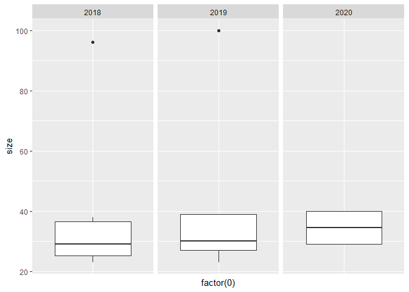

Class Size
================
Jason Smith
5/13/2020

``` r
library(readxl)
library(tidyverse)
class_sizes <- read_excel("data/class_sizes.xlsx")
```

``` r
in_person <- filter(class_sizes, in_person == 1)
```

``` r
in_person %>% 
  group_by(year) %>% 
  summarise(
    n = n(),
    sd = sd(size),
    min = min(size),
    median = median(size),
    max = max(size)
  )
```

    ## # A tibble: 3 x 6
    ##    year     n    sd   min median   max
    ##   <dbl> <int> <dbl> <dbl>  <dbl> <dbl>
    ## 1  2018     6 28.0     23   29      96
    ## 2  2019     9 23.7     23   30     100
    ## 3  2020     4  6.35    29   34.5    40

``` r
in_person %>% 
  ggplot(aes(x = factor(0), y = size))+
  geom_boxplot()+
  facet_wrap("year")+
  theme(axis.text.x = element_blank())+
  theme(axis.ticks.x = element_blank())
```

<!-- -->

``` r
in_person %>% 
  group_by(department) %>% 
  summarise(
    n = n(),
    sd = sd(size),
    min = min(size),
    median = median(size),
    max = max(size)
  )
```

    ## # A tibble: 7 x 6
    ##   department             n     sd   min median   max
    ##   <chr>              <int>  <dbl> <dbl>  <dbl> <dbl>
    ## 1 Biology                3 39.8      23   32      96
    ## 2 Business               1 NA       100  100     100
    ## 3 Economics              7  3.53     30   39      40
    ## 4 Honors College         2  0        25   25      25
    ## 5 Mathematics            3  3.06     23   27      29
    ## 6 Statistics             2  0.707    29   29.5    30
    ## 7 University Studies     1 NA        26   26      26
